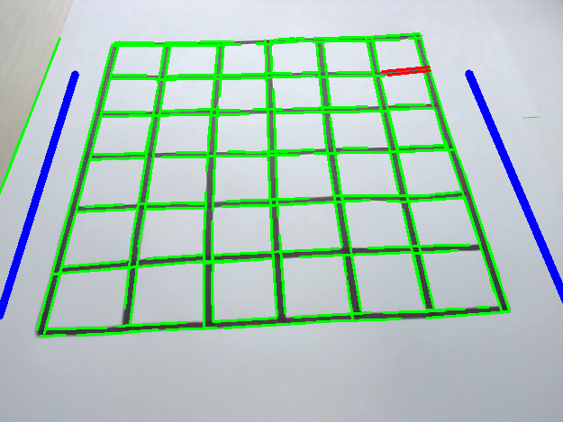
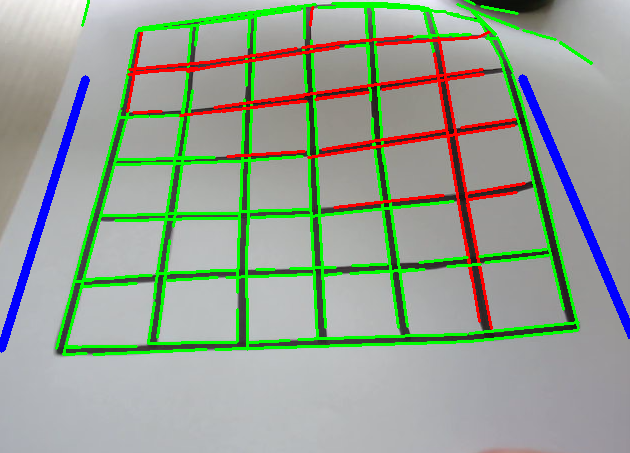

# What is
The project aims to detect bumps occurring on an A4 grid paper sheet.

# How to run the code
Clone the repo and draw a grid like the one depicted in the image:

Then, align the blue lines on the frame to the lateral lines of the grid. The important aspect is that they have similar angular coefficient (they are parallel).

# The output
When a bump occurs, the frame will highlight its location by highlighting in red the part of the grid that contains it. 

